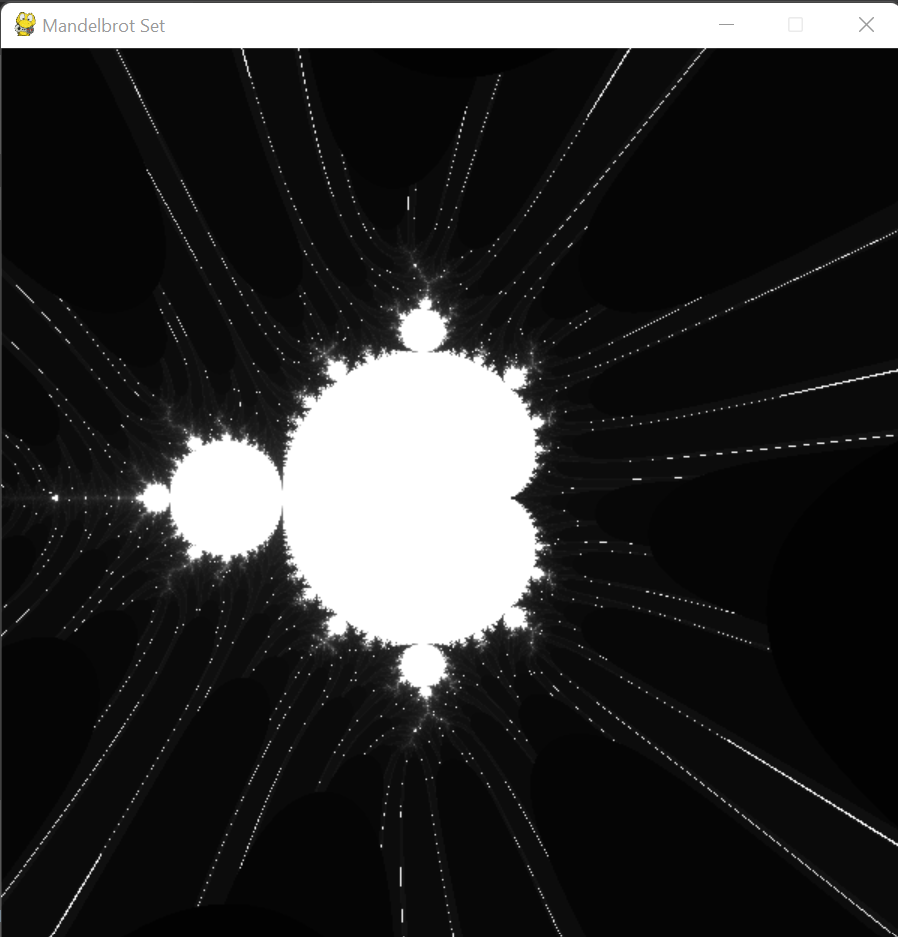

# README

The Mandelbrot Set is the the set of complex numbers of which the function $f = z ^ 2 + c$ does not diverge to infinity when iterated from zero.

With the help of P**yGame**, I was able to provide a picture for this set.

